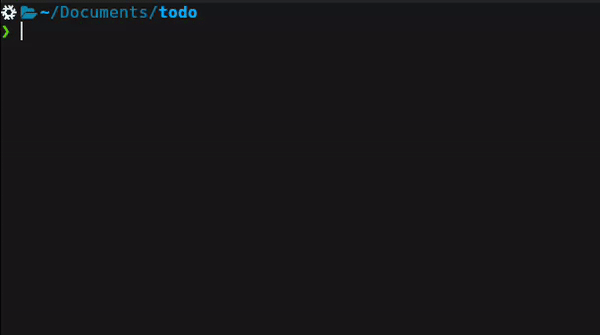

# Usage

```
add  "todo desc"    Add a new task with the provided description.
done [TASK INDEX]   Mark the task at the specified index as completed.
list                Display the current to-do list.
```

# Compilation

```bash
gcc -o todo todo.c
```

# Configuration

The utility stores the to-do list in a file located at $HOME/.config/todo.list, and this file has backwards compatibility with csv